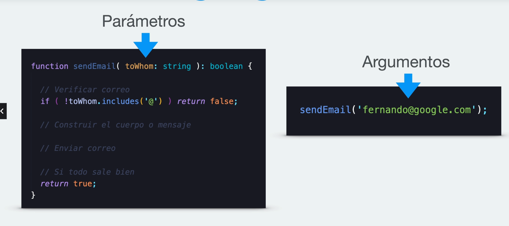
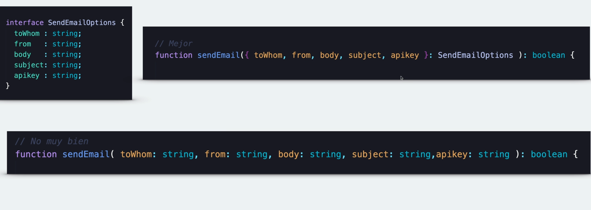

# Funciones

> **"Sabemos que estamos desarrollando código limpio cuando cada función
hace exactamente lo que su nombre indica."**
    - Ward Cunningham

## Parámetros y argumentos

- Se recomienda limitar los parámetros posicionales a **3**

- Si se tuviera que recibir más de tres parámetros: 
    Podemos crear un objeto con los argumentos y en el momento de obtener los parámetros en la funcion, podemos desestructurar los parámetros del objeto.

    