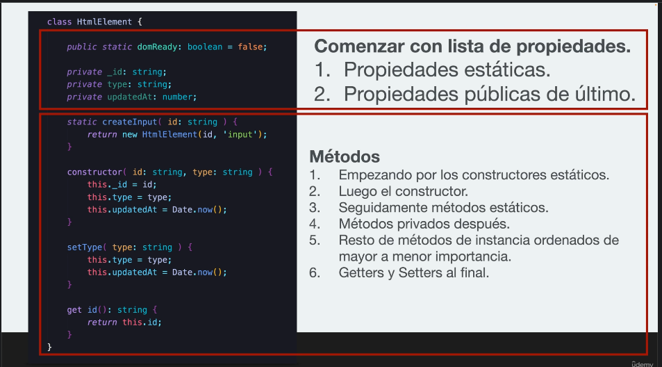

# Estructura recomendada de una clase

> **"El buen código parece estar escrito por quien le importa"**
    - Michael Feathers

## Comenzar con lista de propiedades
    1. Propiedades estáticas
    2. Propiedades públicas de último.
    3. Métodos
        1. Empezando con constructor estático
        2. Luego el constructor
        3. Métodos Estáticos
        4. Métodos Privados después.
        5. Resto de métodos de instancia ordenados de mayor a menor importancia
        6. Getters y Setters al final.

