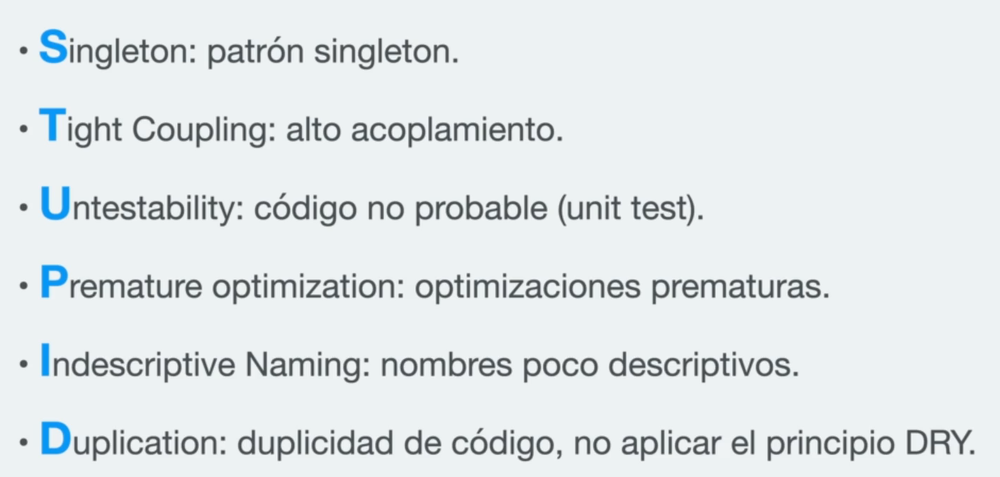
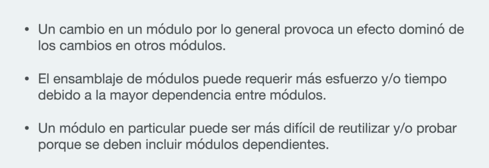
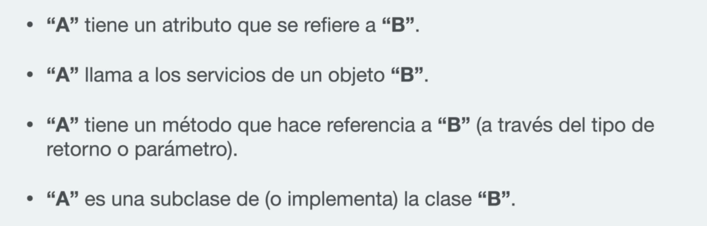
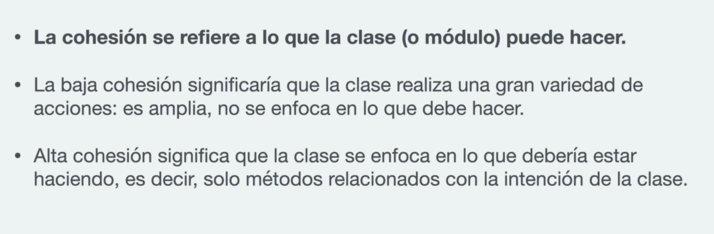
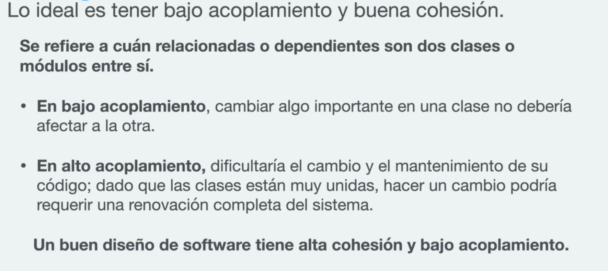
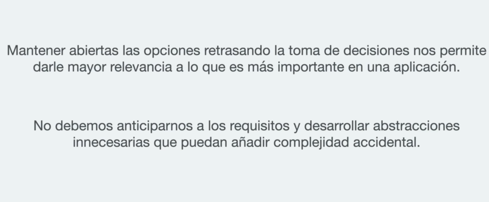
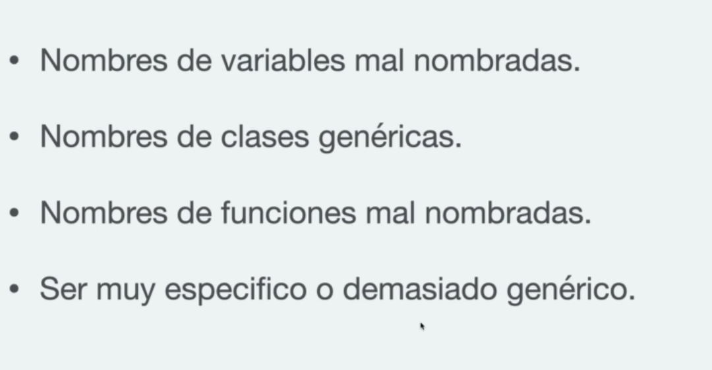
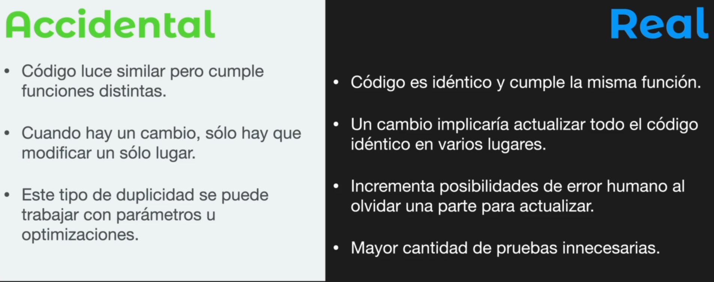

# Acrónimo STUPID

6 Code Smells que debemos evitar

## Patrón Singleton

### Pros:

- Garantiza una única instancia de la clase a lo largo de toda la aplicación.

### Contras:

- Vive en el contexto global.
- Puede ser modificado por cualquiera y en cualquier momento.
- No es rastreable.
- Dificil de testar debido a su ubicación.

## Alto acoplamiento

Lo ideal es tener bajo acoplamiento y buena cohesión

### Acoplamiento

### Desventajas:

### Posibles soluciones:

### Cohesión

### Recomendación

## Código no probable

código dificilmente testeable

- Código con alto acoplamiento
- Código con muchas dependencias no intectadas
- Dependencias en el contexto global (Tipo Singleton)

## Optimizaciones prematuras

Tiene que haber un balance entre una complejidad esencial y una accidental

## Nombres poco descriptivos

## Duplicidad de Código

